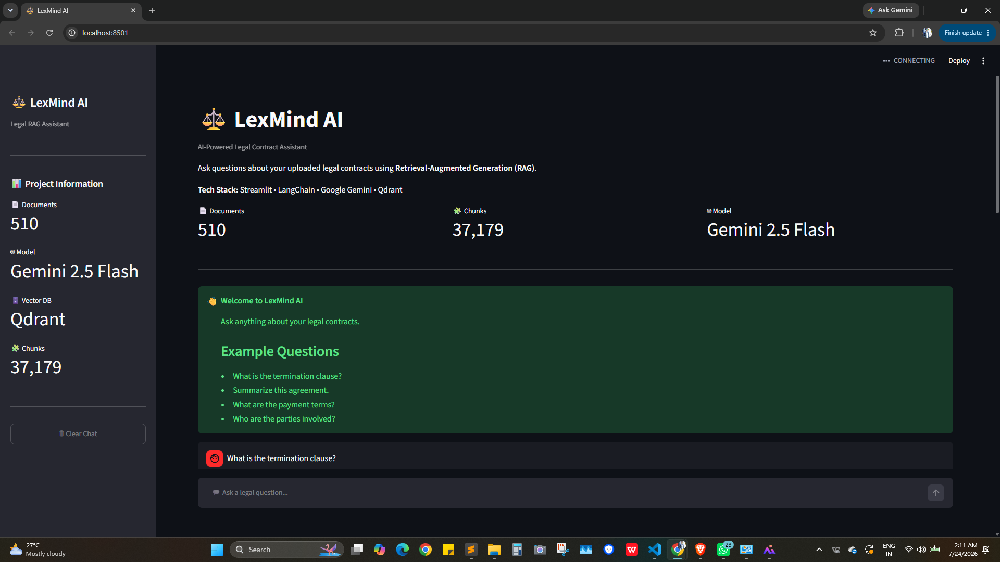
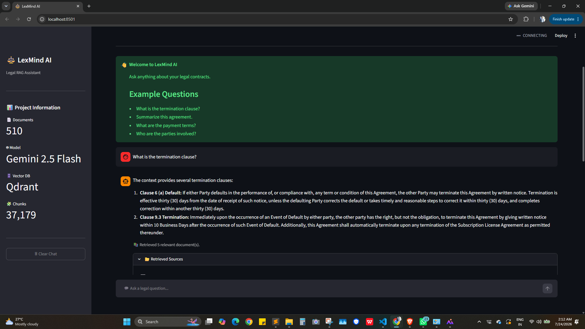
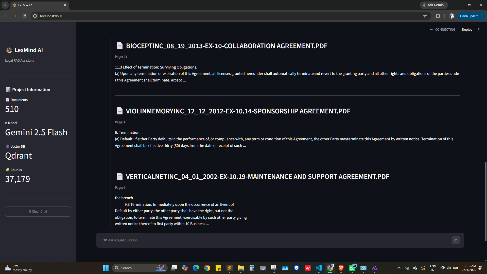

# ⚖️ LexMind AI

> AI-powered Legal Document Assistant using Retrieval-Augmented Generation (RAG)


---

## 📌 Overview

LexMind AI is a Retrieval-Augmented Generation (RAG) application that enables users to ask natural language questions about legal contracts and receive context-aware answers backed by relevant document sources.

The application combines semantic search with Google's Gemini 2.5 Flash model to provide accurate and explainable responses from large collections of legal documents.

---

## 🚀 Features

- 📄 Chat with legal PDF documents
- 🔍 Semantic search using vector embeddings
- 🤖 Google Gemini 2.5 Flash integration
- ⚡ Fast document retrieval with Qdrant
- 🧠 Retrieval-Augmented Generation (RAG)
- 💬 Interactive Streamlit chat interface
- 📚 Source document citations
- 📂 Multi-document support

---

## 🛠 Tech Stack

| Category | Technology |
|-----------|------------|
| Language | Python |
| Frontend | Streamlit |
| LLM | Google Gemini 2.5 Flash |
| Framework | LangChain |
| Embeddings | HuggingFace Embeddings |
| Vector Database | Qdrant |
| Document Loader | PyPDFLoader |
| Text Splitting | RecursiveCharacterTextSplitter |

---

## 📁 Project Structure

```
LexMind-AI/
│
├── app.py
├── ingest.py
├── requirements.txt
├── docker-compose.yml
├── README.md
│
├── src/
│   ├── rag_chain.py
│   ├── embedding_model.py
│   ├── vector_store.py
│   ├── config.py
│   └── utils.py
│
├── components/
├── assets/
├── data/
└── tests/
```

---

## ⚙️ Installation

Clone the repository

```bash
git clone https://github.com/var444/LexMind-AI.git
```

Move into the project

```bash
cd LexMind-AI
```

Install dependencies

```bash
pip install -r requirements.txt
```

Run Qdrant

```bash
docker compose up -d
```

Ingest documents

```bash
python ingest.py
```

Start the application

```bash
streamlit run app.py
```

---

## 💡 How It Works

1. Upload legal documents
2. Documents are split into chunks
3. Embeddings are generated
4. Embeddings are stored in Qdrant
5. User asks a question
6. Relevant chunks are retrieved
7. Gemini generates an answer using retrieved context
8. Sources are displayed to the user

---

## 🎯 Future Improvements

- User authentication
- Conversation memory
- Multi-user support
- PDF upload through UI
- Cloud deployment
- Citation highlighting
- Advanced filtering

---
---

## 📸 Application Preview

### 🏠 Home Screen



### 💬 Chat Interface



### 📚 Source References



**Varun Rathore**

- GitHub: https://github.com/var444

---

⭐ If you found this project useful, consider giving it a star.
